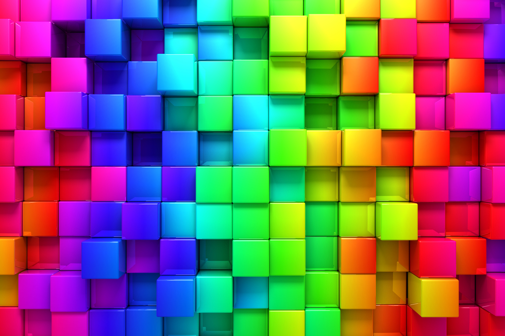

# RGB To Hex & Hex To RGB Converter App 🎨 🌈

It is an iOS application related to RGB to Hex and Hex to RGB conversions.  
The application is developed with Swift.  
Conversions are made according to the values received from the user.  
The background color of the application changes depending on the values obtained in the conversions.  

 

## What is RGB?

It is a color system consisting of the colors Red, Green and Blue. 
The RGB color system is used in digital systems (scanners, digital cameras, etc.) and monitors that mimic the human eye.

 

## What is Hex(Hexadecimal)?

Hexadecimal Values that the hexadecimal system can take: 0,1,2,3,4,5,6,7,8,9,A,B,C,D,E,F,  
It is called hexadecimal because the total number of characters from 0 to F is 16.

 

## RGB to hex conversion

Convert the red, green, and blue color values from decimal to hexadecimal.  
Red, green and blue togather: Combine 3 hexes of RRGGBB.  

### Examples

__Example #1__

Convert red color (255,0,0) to hex color code:

R = (255)10 = (FF)16

G = (0)10 = (00)16

B = (0)10 = (00)16

So the hex color code is:

Hex = FF0000

   

__Example #2__

Convert gold color (255,215,0) to hex color code:

R = (255)10 = (FF)16

G = (215)10 = (D7)16

B = (0)10 = (00)16

So the hex color code is:

Hex = FFD700

   

## Hex to RGB conversion

Altı renk kodunun 2 sol hanesini alın ve kırmızı renk seviyesini elde etmek için ondalık değere dönüştürün.  
Altı renk kodunun 2 orta basamağını alın ve yeşil renk seviyesini elde etmek için ondalık değere dönüştürün.  
Altıgen renk kodunun 2 hanesini alın ve mavi renk seviyesini elde etmek için ondalık değere dönüştürün.  

### Examples

__Example #1__

Convert red hex color code FF0000 to RGB color:

Hex = FF0000

So the RGB colors are:

R = (FF)16 = (255)10

G = (00)16 = (0)10

B = (00)16 = (0)10

OR

RGB = (255, 0, 0)

   

__Example #2__

Convert gold hex color code FFD700 to RGB color:

Hex = FFD700

So the RGB colors are:

R = (FF)16 = (255)10

G = (D7)16 = (215)10

B = (00)16 = (0)10

OR

RGB = (255, 215, 0)

   

Yararlanılan Linkler

1 - https://www.udemy.com/ios11tutorial/learn  
2 - https://www.rapidtables.com/convert/color/rgb-to-hex.html  
3 - https://www.rapidtables.com/convert/color/hex-to-rgb.html  
4 - http://www.matbuu.com/yardimmerkezi/rgb-nedir/  
5 - https://ahmetimamoglu.com.tr/bit-byte-binary-decimal-ve-hexadecimal-nedir  

