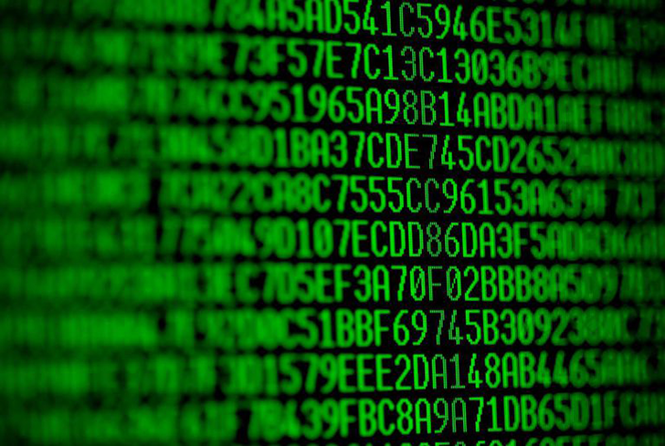

# RGB to Hex & Hex to RGB Converter App ❤️ 🤍

RGB to Hex ve Hex to RGB dönüşümleri ile ilgili bir iOS uygulamasıdır.  
Uygulama Swift-4.2 ile geliştirilmektedir.  
Kullanıcıdan alınan değerlere göre dönüşümler yapılmaktadır.  
Dönüşümlerde elde edilen değerlere göre uygulamanın arka plan rengi değişmektedir.  

 

## RGB Nedir ?

Red (kırmızı) , Green (yeşil), Blue (mavi) renklerinden oluşmuş, bir renk sistemidir. 
RGB renk sistemi, insan gözünü taklit eden dijital sistemlerde (tarayıcılar, dijital kameralar vb.) ve monitörlerde kullanılır.

 

## Hex(Hexadecimal) Nedir ?

Hexadecimal “On altılık†düzenin alabileceği değerler; 0,1,2,3,4,5,6,7,8,9,A,B,C,D,E,F’dir,  
0’dan F’ye kadar olan karakterlerin toplam adedi 16 olduğu için on altılık düzen denilmektedir. 

 

## RGB to hex conversion

Kırmızı, yeşil ve mavi renk değerlerini onluktan onaltıya dönüştürün.  
Kırmızı, yeşil ve mavi togather: RRGGBB'nin 3 hex değerini birleştirin.  

### Examples

__Example #1__

Convert red color (255,0,0) to hex color code:

R = (255)10 = (FF)16

G = (0)10 = (00)16

B = (0)10 = (00)16

So the hex color code is:

Hex = FF0000

   

__Example #2__

Convert gold color (255,215,0) to hex color code:

R = (255)10 = (FF)16

G = (215)10 = (D7)16

B = (0)10 = (00)16

So the hex color code is:

Hex = FFD700

   

## Hex to RGB conversion

Altı renk kodunun 2 sol hanesini alın ve kırmızı renk seviyesini elde etmek için ondalık değere dönüştürün.  
Altı renk kodunun 2 orta basamağını alın ve yeşil renk seviyesini elde etmek için ondalık değere dönüştürün.  
Altıgen renk kodunun 2 hanesini alın ve mavi renk seviyesini elde etmek için ondalık değere dönüştürün.  

### Examples

__Example #1__

Convert red hex color code FF0000 to RGB color:

Hex = FF0000

So the RGB colors are:

R = (FF)16 = (255)10

G = (00)16 = (0)10

B = (00)16 = (0)10

OR

RGB = (255, 0, 0)

   

__Example #2__

Convert gold hex color code FFD700 to RGB color:

Hex = FFD700

So the RGB colors are:

R = (FF)16 = (255)10

G = (D7)16 = (215)10

B = (00)16 = (0)10

OR

RGB = (255, 215, 0)

   

Yararlanılan Linkler

1 - https://www.udemy.com/ios11tutorial/learn  
2 - https://www.rapidtables.com/convert/color/rgb-to-hex.html  
3 - https://www.rapidtables.com/convert/color/hex-to-rgb.html  
4 - http://www.matbuu.com/yardimmerkezi/rgb-nedir/  
5 - https://ahmetimamoglu.com.tr/bit-byte-binary-decimal-ve-hexadecimal-nedir  

